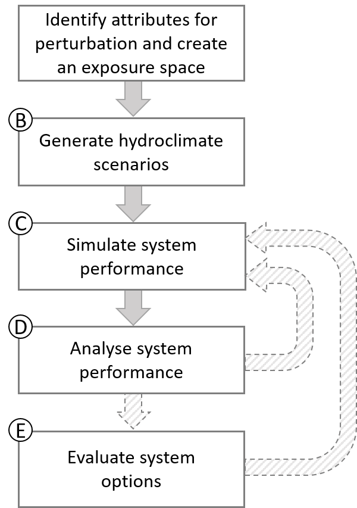

```{r setup, include=FALSE}
knitr::opts_chunk$set(echo = TRUE, collapse = TRUE, comment = "#>")
library(foreSIGHT)
#devtools::load_all()
```

# 1. Overview

This vignette demonstrates the use of stochastic weather generators for producing perturbed climates for 'stress-testing' a system using *fore*SIGHT. The inverse approach (Guo et al. 2018) is used to optimise the parameters of one or more stochastic weather generators. The examples in this vignette both collate---and provide context to---information scattered in the function help files to discuss the considerations for application of *fore*SIGHT to more complex case studies and systems.

It is assumed that the reader has already read the *Quick Start Guide* vignette, and is familiar with the basic *fore*SIGHT work flow demonstrated below:

```{r CRAFTWorkflow, echo=FALSE, fig.cap="Workflow of climate 'stress-testing' using foreSIGHT", out.width = '30%'}

```

In this vignette, you'll learn how to use *fore*SIGHT to generate and evaluate stochastic weather simulations that perturb a wide range of climate attributes. This is relevant to Steps A and B in the *fore*SIGHT workflow, with topics including:

-   **Understanding attribute names**: Variables, time scales, stratification, and relevant time series statistics.
-   **Creating an exposure space**: Defining perturbed, held, and tied attributes to generate realistic climate time series.
-   **Selecting and configuring stochastic weather generators (SWGs)**: Choosing suitable models, generating perturbed series, and adjusting default model settings.
-   **Applying post-processing routines**: Capturing climate features not represented directly by the SWGs.
-   **Customising optimisation settings**: Modifying optimisation settings and setting penalty weights for specific attributes.
-   **Evaluating stochastic climates**: Assessing how well simulations match target attributes, capture secondary changes, and represent climate features relevant to your system model.

We begin by introducing the key concepts and showing how they are implemented in the *fore*SIGHT package. These concepts are then illustrated through a case study, which stress-tests how streamflow in Scott Creek, South Australia, responds to changes in climate attributes across multiple metrics.

# 2. Creating the exposure space

[**Step A**]{.underline}

## 2.1. Attribute naming convention

*fore*SIGHT offers a uniquely flexible capability to perturb any number of climate attributes—either individually or in combination. To support this flexibility, attribute names follow a standardized naming convention in the format: “*var*\_*agg*\_*strat*\_*funcPars*\_*op*”, where

-   “*var*” is the variable name,
-   “*agg*” is the aggregation period,
-   “*strat*” is temporal stratification,
-   “*func*” is function name (with “*Pars*” denoting additional optional parameters), and
-   “*op*” is an optional operation.

For example, “P_year_all_avg” is the average yearly calculated using all the data rainfall (i.e. mean annual rainfall) and “P_day_all_P99_m” is annual mean of the 99th percentile of rainfall calculated over all days.

### **2.1.1. Variable names**

Any string (that does not contain the separating character '\_'), and could include:

-   “P”: rainfall
-   “T”: temperature
-   “PET”: Potential evapotranspiration

### **2.1.2. Temporal stratifications**

-   “ann”: data from entire year
-   “JJA”, “SON”, etc: seasons
-   “Jan”, “Feb”, etc: months

### **2.1.3. Function names** (and optional parameters)

-   “tot”: total
-   “P99”: 99th percentile
-   “maxDSDT1”: maximum dry-spell duration (with threshold above 1mm)

A full list of attribute functions supported in *fore*SIGHT can be viewed using the helper functions `viewAttributeFuncs()`. Table 1 provides a summary of these functions.

+----------------------+-------------------------------------------------------------------------+---------------------+----------------------------------------------+--------------------------+--------------+
| **Function name**    | **Description**                                                         | **Options:**        | **Options:**                                 | **Options:**             | **Typical**  |
|                      |                                                                         |                     |                                              |                          |              |
|                      |                                                                         | **Syntax**          | **Description**                              | **Default**              | **variable** |
+----------------------+-------------------------------------------------------------------------+---------------------+----------------------------------------------+--------------------------+--------------+
| avg                  | Average (mean)                                                          | \-                  | \-                                           | \-                       | Any          |
+----------------------+-------------------------------------------------------------------------+---------------------+----------------------------------------------+--------------------------+--------------+
| avgDSD               | Average dryspell duration (below threshold)                             | avgDSDT*x*          | Threshold, *x*                               | *x=0*                    | P (rainfall) |
+----------------------+-------------------------------------------------------------------------+---------------------+----------------------------------------------+--------------------------+--------------+
| avgDwellTime         | Average dwell time, i.e. average of periods with below median value     | \-                  | \-                                           | \-                       | Any          |
+----------------------+-------------------------------------------------------------------------+---------------------+----------------------------------------------+--------------------------+--------------+
| avgWSD               | Average wetspell duration                                               | avgWSDT*x*          | Threshold, *x*                               | *x=0*                    | P (rainfall) |
+----------------------+-------------------------------------------------------------------------+---------------------+----------------------------------------------+--------------------------+--------------+
| cor                  | Lag-1 autocorrelation                                                   | \-                  | \-                                           | \-                       | Any          |
+----------------------+-------------------------------------------------------------------------+---------------------+----------------------------------------------+--------------------------+--------------+
| cv                   | Coefficient of variation (sdev/mean)                                    | \-                  | \-                                           | \-                       | Any          |
+----------------------+-------------------------------------------------------------------------+---------------------+----------------------------------------------+--------------------------+--------------+
| dyWet                | Average rainfall on wet days (above threshold)                          | dyWetT*x*           | Threshold, *x*                               | *x=0*                    | P (rainfall) |
+----------------------+-------------------------------------------------------------------------+---------------------+----------------------------------------------+--------------------------+--------------+
| F0                   | Number of frost days (below zero)                                       | \-                  | \-                                           | \-                       | Temperature  |
+----------------------+-------------------------------------------------------------------------+---------------------+----------------------------------------------+--------------------------+--------------+
| maxDSD               | Maximum dry spell duration (below threshold)                            | maxDSDT*x*          | Threshold, *x*                               | *x=0*                    | P (rainfall) |
+----------------------+-------------------------------------------------------------------------+---------------------+----------------------------------------------+--------------------------+--------------+
| maxWSD               | Maximum wet spell duration (above threshold)                            | maxWSDT*x*          | Threshold, *x*                               | *x=0*                    | P (rainfall) |
+----------------------+-------------------------------------------------------------------------+---------------------+----------------------------------------------+--------------------------+--------------+
| normP                | Normalised percentile (percentile divided by mean)                      | normP*x*            | Probability (%), *x*                         | None (must be specified) | Any          |
+----------------------+-------------------------------------------------------------------------+---------------------+----------------------------------------------+--------------------------+--------------+
| nWet                 | Number of wet days (above threshold)                                    | nWetT*x*            | Threshold, *x*                               | *x=0*                    | P (rainfall) |
+----------------------+-------------------------------------------------------------------------+---------------------+----------------------------------------------+--------------------------+--------------+
| P                    | Percentile                                                              | P*x*                | Probability (%), *x*                         | None (must be specified) | Any          |
+----------------------+-------------------------------------------------------------------------+---------------------+----------------------------------------------+--------------------------+--------------+
| R                    | Number of days above a threshold (often used for temperature)           | R*x*                | Threshold, *x*                               | None (must be specified) | Temperature  |
+----------------------+-------------------------------------------------------------------------+---------------------+----------------------------------------------+--------------------------+--------------+
| rng                  | Inter-quantile range                                                    | rng*x*              | Probability (%), *x*                         | *x=90*                   | Temperature  |
+----------------------+-------------------------------------------------------------------------+---------------------+----------------------------------------------+--------------------------+--------------+
| seasRatio            | Seasonality ratio (ratio of seasonal to total rainfall)                 | seasRatio*Mon1Mon2* | Start and end months of season, *Mon1, Mon2* | *Mon1=Mar*               | P (rainfall) |
|                      |                                                                         |                     |                                              |                          |              |
|                      |                                                                         |                     |                                              | *Mon2=Aug*               |              |
+----------------------+-------------------------------------------------------------------------+---------------------+----------------------------------------------+--------------------------+--------------+
| tot                  | Total                                                                   | \-                  | \-                                           | \-                       | P (rainfall) |
+----------------------+-------------------------------------------------------------------------+---------------------+----------------------------------------------+--------------------------+--------------+
| WDcor                | Lag-1 autocorrelation for wet days                                      | \-                  | \-                                           | \-                       | P (rainfall) |
+----------------------+-------------------------------------------------------------------------+---------------------+----------------------------------------------+--------------------------+--------------+
| wettest6monPeakDay   | Day of year corresponding to the wettest 6 months                       | \-                  | \-                                           | \-                       | P (rainfall) |
+----------------------+-------------------------------------------------------------------------+---------------------+----------------------------------------------+--------------------------+--------------+
| wettest6monSeasRatio | Ratio of wet season to dry season rainfall, based on wettest6monPeakDay | \-                  | \-                                           | \-                       | P (rainfall) |
+----------------------+-------------------------------------------------------------------------+---------------------+----------------------------------------------+--------------------------+--------------+

: *Table 1: List of attribute functions available in foreSIGHT.*

*fore*SIGHT also allows users to define their own custom functions. The names of these functions must have the format “func_customName”, where “customName” is the custom attribute function. These functions must have the argument “data”, which represents the time series of climate data. For example,

```{r, R.options = list(width = 100)}
func_happyDays = function(data){
  return(length(which((data>25)&(data<30))))
}
```

can be used in the attribute “Temp_day_all_happyDays_m” for calculating the average number of days each year with temperatures between 25^o^C and 30^o^C.

### **2.1.4. Operator name**

The operator name is optional, and currently is limited to “m”: mean value of metric calculated over all years. Often “*op*” will be left empty.

The use of the operator “m” is a subtle, but important, choice. It determines whether the metric is calculated once using all the data (when operator is not specified), or whether the metric is calculated for each year, and then averaged over all years (when operator specified as "m"). For example, “P_day_all_P99” refers to the 99th percentile of daily rainfall calculated over all days, while “P_day_all_P99_m” would be the mean value of the 99th percentile of daily rainfall from each year.

The flexibility of attribute names can lead to some equivalence in attributes. E.g. "P_day_all_tot_m" is mean annual value of the total of daily rainfall. This is equivalent to "P_year_all_avg" - the average of the yearly rainfall.

It is noted that attributes are specified either as a fractional change relative to historical levels (and thus do not have units), or they are specified using the metric system.

### 2.1.5. Viewing attribute definitions and values

The definition of climate attributes used in *fore*SIGHT can be viewed using the helper function `viewAttributeDef()` available in the package.

```{r atts, R.options = list(width = 100)}
viewAttributeDef("P_day_all_tot_m")
```

Can calculate attributes using `calculateAttributes()`

```{r}
data("tankDat")
calculateAttributes(climateData = tank_obs,attSel =c('P_day_all_tot_m','P_day_all_P99'))
```

### 2.1.6. Multivariable attributes

*fore*SIGHT also supports the calculation of multivariable climate attributes, which are based on the interaction between two time series (e.g., precipitation, P, and potential evapotranspiration, PET ).

Multivariable attributes follow the naming convention “mv.*Var1*.*Var2*\_*agg*\_*strat*\_*func*\_*op*”, where

-   "*Var1*" and "*Var2*" are time series of climate variables

-   "*func*" is the multivariable function name

-   Other components ("*agg*", "*strat*", "*op*") are defined as per single-variable attributes

Examples include

-   "mv.P.Temp_day_all_cor" which calculates correlation between daily precipitation and temperature

-   "mv.P.PET_day_MAM_avgWetDay" which is average value of PET on wet days (when P\>0) between March and May.

Currently, a limited number of built-in multivariable attributes are available in *fore*SIGHT, as listed in Table 2.

| Function name | Description                                                                   | Typical variable 1 | Typical variable 2 |
|---------------|-------------------------------------------------------------------------------|--------------------|--------------------|
| avgDryDay     | Average value of variable 2 on dry days (assuming P is variable 1)            | P (rainfall)       | Temp, PET          |
| avgWetDay     | Average value of variable 2 on dry days (assuming P is variable 1)            | P (rainfall)       | Temp, PET          |
| cor           | Correlation between variables                                                 | P (rainfall)       | Temp, PET          |
| cvDryDay      | Coefficient of variation of variable 2 on dry days (assuming P is variable 1) | P (rainfall)       | Temp, PET          |
| cvWetDay      | Coefficient of variation of variable 2 on wet days (assuming P is variable 1) | P (rainfall)       | Temp, PET          |

: *Table 2: List of multivariable attribute functions*

Users can also define their own custom multivariable functions. For an example of the input and output requirements of these functions, see the built-in function `mvFunc_cor()`.

```{r}
mvFunc_cor
```

## **2.2. Creating the exposure space**

The `createExpSpace()` function is used to define the **exposure space**—a set of perturbations applied to selected climate attributes. The general process for specifying perturbed attributes, along with the sampling strategy and bounds, follows the same principles outlined in the *Quick Start Guide* vignette.

To generate **realistic climate time series**, it is often necessary not only to perturb key attributes but also to specify **held** and **tied** attributes. As a rule of thumb, the total number of **target attributes** (including perturbed, held, and tied attributes) should be at least as large as the number of fitted parameters in the stochastic weather generator (SWG). This relationship is discussed further in later sections.

### **2.2.1. Perturbed attributes** 

As shown in the *Quick Start Guide*, the **scaling approach** for generating perturbed climates allows only a limited set of attributes to be explicitly modified—typically:

-    Annual averages and totals (e.g., `P_day_all_tot_m`, `Temp_day_all_avg`)

-   Seasonality ratios (e.g., `P_day_all_seasRatioMarAug`)

By contrast, **stochastic simulation** enables a much broader set of attributes to be perturbed. The actual attributes that can be modified depend on the capabilities of the specific stochastic generator being used (see Section 3.1.1 and 3.1.2 for more details).

### **2.2.2. Held attributes**

To maintain realistic climate behavior, certain attributes can be **held constant**, typically at their historical values. This is especially useful to prevent perturbations from producing unrealistic extremes or seasonal patterns.

Held attributes are specified using the `attHold` argument. For example:

`attHold <- c("P_day_all_P99", "P_day_all_maxWSD_m", "P_day_all_seasRatioMarAug")`

In this case, these three attributes are held at reference levels. The attributes 99th percentile rainfall, maximum length of the wet spells are held at reference levels so that the perturbations do not result in unrealistic extreme rainfall events. In addition, the attribute "P_day_all_seasRatioMarAug" is held at reference levels so that the seasonal cycle of the generated data is realistic.

There are also mechanisms to ensure to preferentially matching the desired values of some attributes during time series generation (as described in Section 3.1.3).

### 2.2.3. Tied attributes

Attributes can also be **tied** together, meaning they share the same perturbation. This is useful when certain attributes are logically or physically linked.

For example, to ensure that **JJA rainfall totals** (`P_day_JJA_tot_m`) change in line with **annual rainfall totals** (`P_day_all_tot_m`), use:

`attTied <- list(P_day_all_tot_m = c("P_day_JJA_tot_m"))`

In some situations, it may be beneficial to tie **attributes for each season** to their equivalent derived from the full time series. For example, tying seasonal 99th percentiles to the overall 99th percentile:

```{r}
attTied <- setSeasonalTiedAttributes(attSel = "P_day_all_P99") 
attTied 
```

This will tie `P_day_DJF_P99` , `P_day_MAM_P9` , `P_day_JJA_P99 and P_day_SON_P99` to the attribute `P_day_all_P99`, ensuring consistent changes across seasons.

[**Example**]{.underline}

```{r}
############################################################################
# create exposure space

attPerturbType = "regGrid"
# perturb seasonality and 99% rainfall
attPerturb = c('P_day_all_seasRatioJunAug','P_day_all_P99')
# consider a small 2x2 grid
attPerturbSamp = c(2,2)
attPerturbMin = c(0.7,1.)
attPerturbMax = c(1.3,1.3)
# will hold a number of attributes to historical values
attHold = c('P_day_all_tot','P_day_all_avgDSD',
            'P_day_all_nWet',
            'P_day_DJF_avgDSD','P_day_MAM_avgDSD',
            'P_day_JJA_avgDSD','P_day_SON_avgDSD',
            'P_day_DJF_nWet','P_day_MAM_nWet',
            'P_day_JJA_nWet','P_day_SON_nWet',
            'P_day_DJF_tot','P_day_JJA_tot',
            'P_day_SON_tot')
# tied attributes
# note: normP = P99/avg rainfall. normP in each season is tied to P99 
attTied = list(P_day_all_P99=c('P_day_DJF_normP99', 
                               'P_day_MAM_normP99',
                               'P_day_JJA_normP99',
                               'P_day_SON_normP99'),
              P_day_all_seasRatioJunAug=c('P_day_JJA_tot')) # JJA rain tied to seasRatioJuneAug

expSpaceSmall = createExpSpace(attPerturb = attPerturb,
                          attPerturbSamp = attPerturbSamp,
                          attPerturbMin = attPerturbMin,
                          attPerturbMax = attPerturbMax,
                          attPerturbType = attPerturbType,
                          attHold = attHold,
                          attTied = attTied)
```

# **3. Generating perturbed climate scenarios**

[**Step B**]{.underline}

## 3.1. The inverse optimization approach 

The 'inverse' approach to producing perturbed climates uses a numerical optimisation to calibrate parameters in a stochastic weather generator that produces time series with attributes that are as close as possible to the target attributes.

To understand what is going on, we need to get into a bit more theory. Let's imagine we have i=1,...,n different **attributes**, such as mean annual rainfall and 99th percentile of daily rainfall (in which case n=2). The optimisation approach seeks to generate time series that minimise the difference in target values between the attribute values of a simulated time series $a_{i,j}$ and target values $t_{i,j}$, as given by the following equation:

$O(\mathbf{a}_j, \mathbf{t}_j) = \sqrt{\sum_{i=1}^{n} [\lambda_i(a_{i,j} - t_{i,j})]^2}$

Here $\lambda_i$ represents a user-specified penalty parameter for each attribute $i$. The use of larger values for $\lambda_i$ emphasises those attributes in the calibration.

## 3.2. Generating scenarios with generateScenarios()

Generating stochastic perturbed climates in foreSIGHT is carried out using the `generateScenarios().` function. The foreSIGHT help file for this functions provides details on the use of `generateScenarios().Some`key inputs to this function are as follows.

#### **Control file** `(controlFile)`

The `controlFile` argument specifies:

-   The stochastic weather generator (SWG) and any post-priocessing of SWG outputs

-   The optimization settings (weights, numerical optimizer)

-   Parameter bounds

The format and available optoipns for the control file are described in Section 3.1.

(Note that if the `controlFile` argument is not specified or set to `NULL`, the default stochastic model and associated settings will be used to generate the scenarios. If `controlFile='scaling'` , then scaling approaches are used instead of stochastic simulation - see the *Quick Start Guide* vignette.)

#### **Length of perturbed series (**`simLengthNyrs)`

The argument `simLengthNyrs` can be used to specify the desired length of the stochastically generated perturbed time series in years using `generateScenarios`

```{r, simLength} # simulation length of 100 years}
simLengthNyrs = 100
```

#### **Number of replicates (**`numReplicates)`

By default, `generateScenarios` will generate a single replicate (or stochastic realisation) of the perturbed time series. More replicates can be generated by specifying the `numReplicates` argument of `generateScenarios`.

```{r, numRep}
numReplicates = 5
```

#### **The random seed (`seedID`)**

The random seed used for stochastic generation of the first replicate is specified by `seedID`. The random seeds for the subsequent replicates are incremented by 1. Thus, the perturbed stochastic data generated using `generateScenarios()` for the same function arguments would typically be different.

#### **Numbers of core in parallel processing (`cores`)**

The inverse approach is computationally intensie approach to SWG calibration, as it requires many evaluations of the objective function, with each objective function calculation requiring simulation of the SWG and calculating attributes. Furthewrmore, objective function surface can be complex, making optimization challenging.

Combinined with large numbers of replicates and targets and or longer time series, can result in the generation of sceanrios becoming infeasible using a single processor. `generateScenarios()` supports **parallel execution** using multiple cores using the `cores` argument.

## 3.3. S**tochastic simulation options (the control file)**

### 3.1.1. Control file format

Options for stochastic simulation can be modified using the `controlFile` argument in `generateScenarios()`, defining the location of a JSON file.

For example, stochastic models are defined using the `modelType` and `modelParameterVariation` fields in the `controlFile` (as described in Section 3.1.1). The user can create a JSON file for input to `generateScenarios`. As an example, the following text may be used in the JSON file to select alternate models for precipitation and temperature.

```{r, jsonFileModel1, eval = FALSE}
# Example text to be copied to a text JSON file
{
  "modelType": {
    "P": "latent",
    "Temp": "wgenLM"
  },
  "modelParameterVariation": {
    "P": "seas",
    "Temp": "har"
  }
}
```

The helper function `writeControlFile()` available in *fore*SIGHT can be used to create a sample JSON file that provides a template to create control files to specify alternate models that the user needs. The `writeControlFile()` function can be used without arguments as shown below. Note that the following function call will write a JSON file named `sample_controlFile.json` into your working directory.

```{r, jsonFileSample, eval = FALSE}
writeControlFile()
```

Alternatively, the `toJSON` function from the `jsonlite` package can be used to create a JSON file for the `controlFile` from an R list as shown below.

```{r, jsonFileModel2}
# create a list containing the specifications of the selected models
modelSelection <- list()
modelSelection[["modelType"]] <- list()
modelSelection[["modelType"]][["P"]] <- "latent"
modelSelection[["modelType"]][["Temp"]] <- "wgenO"
modelSelection[["modelParameterVariation"]] <- list()
modelSelection[["modelParameterVariation"]][["P"]] <- "seas"
modelSelection[["modelParameterVariation"]][["Temp"]] <- "har"
utils::str(modelSelection)

# write the list into a JSON file
modelSelectionJSON <- jsonlite::toJSON(modelSelection, pretty = TRUE, auto_unbox = TRUE)
write(modelSelectionJSON, file = paste0(tempdir(), "\\eg_controlFile.json"))
```

```{r, jsonFileModel3}
# input a the JSON file
controlFile = paste0(tempdir(), "\\eg_controlFile.json")  
```

### 3.1.1. Stochastic weather generators

There is a plethora of options for stochastic weather generators described in the scientific literature, each with different features and assumptions. This variety provides a high degree of flexibility for perturbing weather time series in a variety of ways to comprehensively 'stress test' a climate-sensitive system. The *fore*SIGHT software currently supports a number of weather generators, and is developed such that developers and advanced users can add other weather generators over time.

The choice depends:

-   **Data timestep.** Most weather generators run at a daily timestep, which is a common timestep for reporting of key weather variables. However there are also weather generators available at various sub-daily timesteps, as well as longer aggregated timesteps such as monthly or annual. The key consideration here is to ensure the time step is consistent with the likely timescales of system performance sensitivity, which in turn need to correspond to the relevant time scales of weather inputs that are require for the system model.

-   **The key timescales of system sensitivity.** In addition to data timestep, it is important that the stochastic generator is able to simulate variability in **Climate Attributes** representing key timescales of system sensitivity. For example some systems may respond at sub-seasonal and seasonal timescales, and others at interannual timescales. It is noted that a stochastic generator may be able to simulate variability at timescales that are equal to or longer than its timestep, but not shorter.

-   **Relevant weather variables.** Weather generators have the capability of simulating a range of surface variables, including precipitation, temperature, wind, solar radiation, humidity and so forth---as well as derived variables such as potential evapotranspiration that are calculated through various recognised formulations. In many cases weather generators simulate precipitation first, followed by the other variables that are then conditioned to the precipitation time series; however each weather generator is different and it is necessary to review the documentation to understand the basis for generating the weather time series.

-   **Other key structural features** that drive the weather generator's capacity to simulate individual or combined changes in attributes. For example, for some systems, it may be important to capture dependence between climate variables or across spatial locations.

A pragmatic approach to assess the appropriateness of weather generation choice is through evaluating the relevant diagnostics in achieving specified target attributes. Poor performance in diagnostics may be due to several issues, including weather generator suitability. The use of weather generator diagnostics is discussed later in this section.

*fore*SIGHT includes a few stochastic models that the user can select to generate the scenarios. The options differ in the time step, model formulation and the temporal variation of the model parameters. The models available in *fore*SIGHT can be viewed using the function `viewModels` as shown below. The `defaultModel` column indicates the default stochastic model that will be used if the `controlFile` argument is `NULL`. The usage of this function is demonstrated below.

```{r, viewModel}
viewModels()  # View the models available for a specific climate variable
viewModels("P")  # View models available for temperature viewModels("Temp")
```

A summary of these models is provided in Table 1 below.

+----------+------------+-----------+---------------------+-------------------------------------------------------------------------------------------------------------------------------------------------------------------------------------------------------------------+
| Variable | Model type | Time step | Parameter variation | Description                                                                                                                                                                                                       |
+:========:+:==========:+:=========:+:===================:+===================================================================================================================================================================================================================+
| P        | latent     | 1 day     | ann                 | 4 parameter latent variable (LV) rainfall model                                                                                                                                                                   |
+----------+------------+-----------+---------------------+-------------------------------------------------------------------------------------------------------------------------------------------------------------------------------------------------------------------+
| "        | "          | "         | seas                | 16 parameter LV rainfall model, with seasonal variations in parameters                                                                                                                                            |
+----------+------------+-----------+---------------------+-------------------------------------------------------------------------------------------------------------------------------------------------------------------------------------------------------------------+
| "        | "          | "         | har                 | 12 parameter LV rainfall model, with harmonic variations in parameters                                                                                                                                            |
+----------+------------+-----------+---------------------+-------------------------------------------------------------------------------------------------------------------------------------------------------------------------------------------------------------------+
| "        | wgen       |           | ann                 | 4 parameter Richardson WGEN rainfall model                                                                                                                                                                        |
+----------+------------+-----------+---------------------+-------------------------------------------------------------------------------------------------------------------------------------------------------------------------------------------------------------------+
| "        | "          | "         | seas                | 16 parameter WGEN rainfall model, with seasonal variations in parameters                                                                                                                                          |
+----------+------------+-----------+---------------------+-------------------------------------------------------------------------------------------------------------------------------------------------------------------------------------------------------------------+
| "        | "          |           | har                 | 12 parameter WGEN rainfall model, with harmonic variations in parameters                                                                                                                                          |
+----------+------------+-----------+---------------------+-------------------------------------------------------------------------------------------------------------------------------------------------------------------------------------------------------------------+
| "        | BLRPM      | 1 hour    | ann                 | 5 parameter Bartlett-Lewis Rectangular Pulse sub-daily rainfall model                                                                                                                                             |
+----------+------------+-----------+---------------------+-------------------------------------------------------------------------------------------------------------------------------------------------------------------------------------------------------------------+
| "        | monAR1     | 1 month   |                     | 4 parameter transformed AR(1) monthly rainfall model                                                                                                                                                              |
+----------+------------+-----------+---------------------+-------------------------------------------------------------------------------------------------------------------------------------------------------------------------------------------------------------------+
| Temp     | wgenO      | 1 day     | ann                 | 3 parameter WGEN AR(1) model for temperature                                                                                                                                                                      |
+----------+------------+-----------+---------------------+-------------------------------------------------------------------------------------------------------------------------------------------------------------------------------------------------------------------+
| "        | "          | "         | seas                | 12 parameter WGEN AR(1) model for temperature, with seasonal variations in parameters                                                                                                                             |
+----------+------------+-----------+---------------------+-------------------------------------------------------------------------------------------------------------------------------------------------------------------------------------------------------------------+
| "        | "          | "         | har                 | 7 parameter WGEN AR(1) model for temperature, with harmonic variations in all parameters except autocorrelation parameter                                                                                         |
+----------+------------+-----------+---------------------+-------------------------------------------------------------------------------------------------------------------------------------------------------------------------------------------------------------------+
| "        | "          | "         | seasWD              | 20 parameter WGEN AR(1) model for temperature, with separate parameters for wet and dry days, and seasonal variations in parameters.                                                                              |
+----------+------------+-----------+---------------------+-------------------------------------------------------------------------------------------------------------------------------------------------------------------------------------------------------------------+
| "        | "          | "         | harWD               | 13 parameter WGEN AR(1) model for temperature, with separate parameters for wet and dry days, and harmonic variations in parameters. A single autocorrelation parameter is used for all seasons and wet-dry days. |
+----------+------------+-----------+---------------------+-------------------------------------------------------------------------------------------------------------------------------------------------------------------------------------------------------------------+
| PET      | "          | "         | seas                | 12 parameter WGEN AR(1) model for PET, with seasonal variations in parameters                                                                                                                                     |
+----------+------------+-----------+---------------------+-------------------------------------------------------------------------------------------------------------------------------------------------------------------------------------------------------------------+
| PET      | "          | "         | har                 | 7 parameter WGEN AR(1) model for PET, with harmonic variations in all parameters except autocorrelation parameter                                                                                                 |
+----------+------------+-----------+---------------------+-------------------------------------------------------------------------------------------------------------------------------------------------------------------------------------------------------------------+
| PET      | "          | "         | seasWD              | 20 parameter WGEN AR(1) model for PET, with separate parameters for wet and dry days, and seasonal variations in parameters.                                                                                      |
+----------+------------+-----------+---------------------+-------------------------------------------------------------------------------------------------------------------------------------------------------------------------------------------------------------------+
| PET      | "          | "         | harWD               | 13 parameter WGEN AR(1) model for PET, with separate parameters for wet and dry days, and harmonic variations in parameters. A single autocorrelation parameter is used for all seasons and wet-dry days.         |
+----------+------------+-----------+---------------------+-------------------------------------------------------------------------------------------------------------------------------------------------------------------------------------------------------------------+

: Table 1: Description of models available in *fore*SIGHT.

The selection of model type and parameter variation can specified in the `controlFile`, as seen in the following example:

```{r}
modelSelection = list()
modelSelection$modelType = list()
modelSelection$modelType$P = "latent"
modelSelection$modelType$PET = "wgenO"

modelSelection$modelParameterVariation = list()
modelSelection$modelParameterVariation$P = "seas"
modelSelection$modelParameterVariation$PET = "harWD"
```

#### Multisite rainfall

*fore*SIGHT supports the generation of multisite precipitation using the latent variable model with the approach introduced by *McInerney et al. (2023)*. This method allows the simulation of rainfall at multiple locations simultaneously, capturing key spatial dependcies. It also allows the exploration of changes in spatial correlation between sites.

To implement this, the reference data must contain precipitation data at multiple sites (see *Quick Start Guide* vignette, Section 2.2), and the latent variable model is specified in the control file. An example is provided in the help documentation for `generateScenarios()`.

### [**3.1.2.** Post-Processing of Stochastic Weather Generator Output]{.underline}

[In addition to generating climate time series using stochastic weather generators (SWGs), **foreSIGHT** provides the ability to apply **post-processing adjustments** to the simulated output. This step helps to address known limitations of SWGs and ensures that certain climate features are better represented or that unrealistic behaviour is constrained.]{.underline}

[These post-processing steps are applied **after** the SWG has generated the time series and are independent of the SWG model itself—meaning they can be used flexibly across different SWG types.]{.underline}

#### [Available Post-Processing Options:]{.underline}

-   [**Annual Variability Adjustment (`annVar`)**\
    Adjusts the interannual variability of the generated time series to better match historical or target levels. This can be important for systems sensitive to year-to-year fluctuations.]{.underline}

-    [**Extreme Value Scaling (`scaleExtremes`, `scaleExtremesSeas`)**\
    Applies constraints to the upper tail of the distribution. This ensures that changes in very high percentiles (e.g. \>99%) scale consistently with the 99th percentile.]{.underline}

    -   [`scaleExtremes`: Applies the adjustment across all data.]{.underline}

    -    [`scaleExtremesSeas`: Applies the adjustment separately for each season.]{.underline}

[These options are particularly useful for controlling **unrealistic extreme values**, such as excessive rainfall events, which could otherwise lead to distorted or misleading system responses in downstream modelling.]{.underline}

[Implemented as follows:]{.underline}

```{r}
modelSelection[['postProcessing']] = list(P=list())
modelSelection[['postProcessing']]$P$types = c('scaleExtremes','annVar')
```

### **3.1.3. Optimization**

#### Objective function weights 

The objective function shownin Section 3.1 allows different attributes to be prioritised in the calibration through the use of the weights $\lambda$ . The precise value of these weights depends on the overall objectives of the problem and will often be adjusted after assessing the diagnostics of the stochastically generated time series (discussed later in this section). The likely usage of this is to provide a means of instructing the optimiser to: 'generate stochastic realisations that reflect the perturbed attributes, while keeping other relevant features of the time series described by the held attributes as close to the reference time series as possible'--- by placing greater priority on the perturbed attributes.

The weights are specified by specifying "`penaltyAttributes`" and "`penaltyWeights`" in the control file. For example, if we want to apply $\lambda=3$ for "P_day_all_tot_m", and $\lambda=2$ for "P_day_all_P99", this is achieved as follows:

```{r}
modelSelection[["penaltyAttributes"]] <- c("P_day_all_tot_m","P_day_all_P99")
modelSelection[["penaltyWeights"]] = c(3,2)
```

Weights for other attributes have the default value of 1.

#### [Parameter bounds]{.underline}

The

[viewModelParameters()]{.underline}

```{r}
viewModelParameters(variable = 'PET',modelType='wgenO',modelParameterVariation='seas')
```

[change model parameter bounds:]{.underline}

```{r}
modelSelection[["modelParameterBounds"]] <- list()
modelSelection[["modelParameterBounds"]][["P"]] <- list()
modelSelection[["modelParameterBounds"]][["P"]][["sigma.SON"]] <- c(0.001, 20)
```

#### [Optimization arguments]{.underline}

```         
viewDefaultOptimArgs()
```

```{r}
modelSelection[["optimisationArguments"]] <- list()
modelSelection[["optimisationArguments"]][["nMultiStart"]] <- 5
modelSelection[["optimisationArguments"]][['RGN.control']]=list(iterMax=50)

```

### [**3.1.4. Advice for dealing with number of parameters and attributes**]{.underline}

-   [recommend that number of target attributes at least as large as number of fitted parameters]{.underline}

-   [fix parameters: mod calibrator or baseline climate]{.underline}

-   [tie attributes, hold attributes]{.underline}

## 3.4. Example

[For computational reasons, the code below is constructed for small 2x2 exposure space and single replicate. This should take \~3 mins to run.]{.underline}

```{r sim.singleRep, eval=TRUE}

# load dates, precip, PET and streamflow data for Scott Creek
data('data_A5030502_1976_1985')

############################################################################

# create reference data - won't include PET here since not modelled 
clim_ref = list(times = data$times,
                 P = data$P)  

############################################################################
# setup model settings

modelSelection = list()

modelSelection$modelType = list()
modelSelection$modelType$P = "latent" # latent variable model

modelSelection$modelParameterVariation = list()
modelSelection$modelParameterVariation$P = "seas" # parameters vary with season

modelSelection[["optimisationArguments"]] = list()
modelSelection[["optimisationArguments"]][["OFtol"]] = 0.1 # stop multi-start optimization when OF < OFtol

# set penalty weights. More weights to perturbed attributes and total rainfall (which is known to have large impact)
modelSelection[["penaltyAttributes"]]=c('P_day_all_seasRatioJunAug',
                                        'P_day_all_P99','P_day_all_tot',
                                           'P_day_all_avgDSD','P_day_all_nWet')
modelSelection[["penaltyWeights"]] = c(3,3,3,1.5,1.5)

# write to JSON file
modelSelectionJSON = jsonlite::toJSON(modelSelection, pretty = TRUE, auto_unbox = TRUE)
controlFile = paste0(tempdir(), "\\eg_controlFile.json")
write(modelSelectionJSON, file = controlFile)

###############
# generate scenarios

time.1 = Sys.time()
sim.singleRep = generateScenarios(reference = clim_ref,
                       expSpace = expSpaceSmall,
                       controlFile = controlFile,
                       seedID = 1,
                       numReplicates = 1,
                       cores = 1)
time.2 = Sys.time()
print(time.2-time.1)

```

## 4. Evaluation of perturbed climates

[users responsibility to evaluate climates.]{.underline}

[if poor, can lead to wrong interpretations about impact of changes in climate attributes.]{.underline}

### **4.1. Evaluation of target attributes**

[*fore*SIGHT contains a function named `plotScenarios()` which can be used to create plots of the biases in attributes of the simulated data relative to the specified target values, for perturbed, held and target attributes. The function uses a simulation performed using `generateScenarios()` as input and plots the mean and standard deviation of the absolute biases of each attribute and target, across all the replicates in heatmap-like plots. The function can be called using a single argument, which is the simulation generated using `generateScenarios()`.]{.underline}

[`p <- plotScenarios(sim)   # sim the output from generateScenarios`]{.underline}

[The figures can be used to assess how well the simulations capture the desired target values of the attributes.]{.underline}

[As a rough estimate, biases around or less than 5% are acceptable. If there are larger mean biases, we recommend that you evaluate the following:]{.underline}

-   [**Optimiser configuration**: Has it had enough scope to find a good solution? If not, adjust its settings.]{.underline}

-   [**Model structure**: Can the model simulate the desired attribute combinations? If not, a different model structure may be required.]{.underline}

-   [**Over-constraint**: Are the target combinations unrealistic or conflicting? If so, revise targets or adjust penalties to prioritise key attributes.]{.underline}

[If the standard deviation of the absolute biases across the replicates are high, this indicates that the attribute value is highly variable across the replicates in the generated data. You may need to]{.underline}

-   [**Under-constrained**: increase number of target attributes (held/tied) or reduce the number of fitted parameters. Require at least the same number of target attributes as fitted parameters.]{.underline}

-   [**Optimization performance**: unable to consistently find parameters that give good performance. Adjust the optimisation parameters]{.underline}

```{r plotScenariosSingleRep, fig.width = 10, fig.height = 10, eval=TRUE}
plotScenarios(sim.singleRep)
```

[We have pre-computed simulated climates for larger 5x5 exposure space, with 10 replicates:]{.underline}

```{r plotExpSpace, eval=FALSE}
#load object sim.multiRepsLarge for full output
data("egScottCreekSimLarge2")

# plot sexposure space
plotExpSpace(sim.multiRepsLarge$expSpace)
```

[Evaluate how well the target attributes are captured by the simulated climates:]{.underline}

```{r plotScenariosMultiRepsLarge, fig.width = 10, fig.height = 10, eval=TRUE}
plotScenarios(sim.multiRepsLarge)
```

### 4.2. E[valuating changes in attributes]{.underline}

[Explore the response of a wide range of attributes (including perturbed/held/tied attributes and independent attributes) to perturbations.]{.underline}

```{r plotPerformanceAtts1, fig.width = 10, fig.height = 20, eval=TRUE}
# select target attributes (perturbed/held/tied)
attSel = colnames(sim.multiRepsLarge$expSpace$targetMat)
# other attributes
attSel = c(attSel,'P_year_all_dwellTime','P_day_all_avgWSD',
           'P_day_all_P99.9','P_day_JJA_P99.9','P_day_SON_P99.9',
           'P_day_DJF_P99.9','P_day_MAM_P99.9')

# plot changes in attributes for perturbations in seasonality ratio
att = "P_day_all_seasRatioJunAug"
old_par <- par(no.readonly = TRUE)  # Save current settings
par(mfrow=c(9,3),mar=c(4,7,2,1))
# plot changes in a single attribute with respect to perturbed attrbiutes
plotPerformanceAttributesOAT(clim=clim_ref,
                             sim=sim.multiRepsLarge,
                             attPerturb=att,
                             attEval=attSel,
                             cex.main = 1.5,cex.xaxis = 1,cex.yaxis = 1)    
```

```{r plotPerformanceAtts, fig.width = 10, fig.height = 20, eval=TRUE}
# plot changes in attrtibutes for perturbations in P99
att = "P_day_all_P99"
par(mfrow=c(9,3),mar=c(4,7,2,1))
# plot changes in a single attribute with respect to perturbed attrbiutes
plotPerformanceAttributesOAT(clim=clim_ref,
                             sim=sim.multiRepsLarge,
                             attPerturb=att,
                             attEval=attSel,
                             cex.main = 1.5,cex.xaxis = 1,cex.yaxis = 1)   

# restore original par settings
par(old_par)
```

## 4.3. Evaluating system response

As in user guide.

Loops over multiple replicates.

[Calculate system response using GR4J_wrapper]{.underline}

```{r GR4JsystemPerf, eval=TRUE}

# observed flow
Qobs = data$Qobs
# observed PET 
PET = data$PET 

dates = as.Date(clim_ref$times)

# calibrate GR4J parameters
Param = setup_cal_GR4J(dates = dates,P=clim_ref$P,PET=PET,Qobs=Qobs)

# setup systemArgs and metrics
systemArgs = list(dates=dates,Param=Param,PET=PET)
metrics = c('meanQ','P99','P25','min3yr')

# calculate system performance metrics for simulated climates
sysOutSim = runSystemModel(sim=sim.multiRepsLarge,systemModel = GR4J_wrapper,systemArgs = systemArgs,metrics = metrics)
```

# 

## Evaluating ability of SWG to capture climate features relevant to system model

Compare system response using observed and (unperturbed) stochastic climates.

```{r, virtualObs, fig.align = 'center', dpi = 100, fig.show = "hold", fig.width = 10, fig.height = 10, out.width = "47%", fig.cap = "Evaluation of stochastic climates in terms of capturing hydrological response to observed climates", eval=TRUE}
eval = evaluate_system_metrics(sim=sim.multiRepsLarge,clim=clim_ref,
                               systemModel=GR4J_wrapper,systemArgs=systemArgs,
                               metrics=metrics)

par(mfrow=c(2,2),mar=c(3,4,1,1))
for (m in 1:length(metrics)){
  metric = metrics[m]
  yAll = c(eval$systemPerf_base[[metric]],eval$systemPerf_obsClim[metric])
  ylim = c(min(yAll),max(yAll))
  boxplot_prob(as.vector(eval$systemPerf_base[[metric]]),ylim=ylim)
  points(eval$systemPerf_obsClim[metric],col='red',pch=19)
  title(metric)
}


```

# [5. Evaluate performance]{.underline}

[**Step D**]{.underline}

[Plot OAT performance:]{.underline}

```{r, GR4J_OATplots, fig.align = 'center', fig.width = 10, fig.height = 10, eval=TRUE}
# performance for changes in P_day_all_seasRatioMarMay (1st attribute)
plotPerformanceOAT(performance = sysOutSim, sim=sim.multiRepsLarge, metric = 'meanQ',attSel=attPerturb[1])
plotPerformanceOAT(performance = sysOutSim, sim=sim.multiRepsLarge, metric = 'P99',attSel=attPerturb[1])
plotPerformanceOAT(performance = sysOutSim, sim=sim.multiRepsLarge, metric = 'P25',attSel=attPerturb[1])

# performance for changes in P_day_all_P99 (2nd attribute)
plotPerformanceOAT(performance = sysOutSim, sim=sim.multiRepsLarge, metric = 'meanQ',attSel=attPerturb[2])
plotPerformanceOAT(performance = sysOutSim, sim=sim.multiRepsLarge, metric = 'P99',attSel=attPerturb[2])
plotPerformanceOAT(performance = sysOutSim, sim=sim.multiRepsLarge, metric = 'P25',attSel=attPerturb[2])
```

[Plot 2D performance spaces:]{.underline}

```{r, GR4J_perfSpace, fig.align = 'center', dpi = 100, fig.show = "hold", fig.width = 10, fig.height = 10, out.width = "47%", fig.cap = "Plots of 2D performance spaces", eval=TRUE}

# plot 2D performance spaces
plotPerformanceSpace(performance = sysOutSim, sim=sim.multiRepsLarge, metric = 'meanQ',type='filled.contour',nContour=5)
plotPerformanceSpace(performance = sysOutSim, sim=sim.multiRepsLarge, metric = 'P99',type='filled.contour',nContour=5)
plotPerformanceSpace(performance = sysOutSim, sim=sim.multiRepsLarge, metric = 'P25',type='filled.contour',nContour=5)
```

### 

# [6. Conclusion]{.underline}

# [Appendix: Case study - Rainfall-runoff response in Scott Creek, South Australia]{.underline}

[Simulated precipitation is generated using a single-site, latent-variable stochastic weather generator (SWG). Streamflow is modelled using the GR4J rainfall-runoff model, implemented via the **airGR** package in R. Key hydrological metrics assessed include mean flow, low flow (25%), and high flow (99%).]{.underline}

?setup_cal_GR4J

?GR4J_wrapper

# References

-   Coron, L., Thirel, G., Delaigue, O., Perrin, C., & Andréassian, V. (2017). The suite of lumped GR hydrological models in an R package. *Environmental Modelling & Software, 94*, 166-171. \doi{ [10.1016/j.envsoft.2017.05.002](http://dx.doi.org/10.1016/j.envsoft.2017.05.002)}

-   Guo, D., Westra, S., & Maier, H. R. (2018). An inverse approach to perturb historical rainfall data for scenario-neutral climate impact studies. *Journal of Hydrology, 556*, 877-890. \doi{ [10.1016/j.jhydrol.2016.03.025](https://doi.org/10.1016/j.jhydrol.2016.03.025)}

-   McInerney, D., Westra, S., Leonard, M., Bennett, B., Thyer, M., & Maier, H. R. (2023). A climate stress testing method for changes in spatially variable rainfall. *Journal of Hydrology, 625*, 129876. \doi{ [10.1016/j.jhydrol.2023.129876](https://doi.org/10.1016/j.jhydrol.2023.129876)}

-   Nguyen, T. H. T., Bennett, B., & Leonard, M. (2023). Evaluating stochastic rainfall models for hydrological modelling. *Journal of Hydrology, 627*, 130381. \doi{[10.1016/j.jhydrol.2023.130381](https://doi.org/10.1016/j.jhydrol.2023.130381)}

-   Rasmussen, P. F. (2013). Multisite precipitation generation using a latent autoregressive model. *Water Resources Research, 49*(4), 1845-1857. \\doi{[0.1002/wrcr.20164](https://doi.org/10.1002/wrcr.20164)}

-   Richardson, C. W. (1981). Stochastic simulation of daily precipitation, temperature, and solar radiation. *Water Resources Research, 17*(1), 182-190. \doi{[10.1029/WR017i001p00182](https://doi.org/10.1029/WR017i001p00182)}
